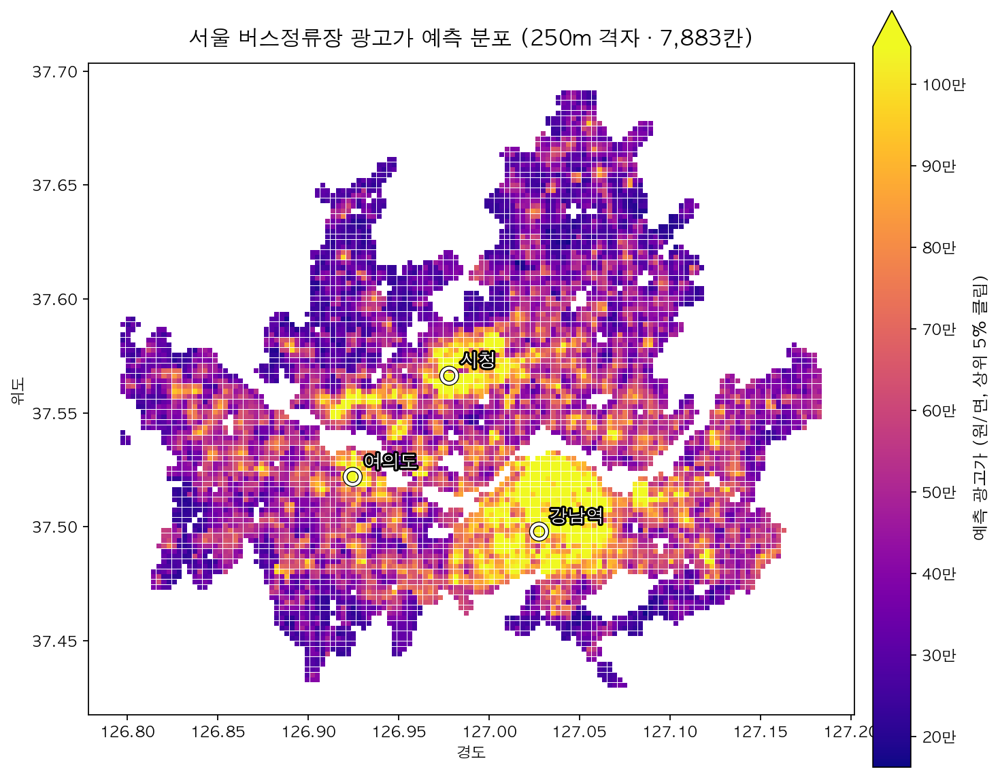
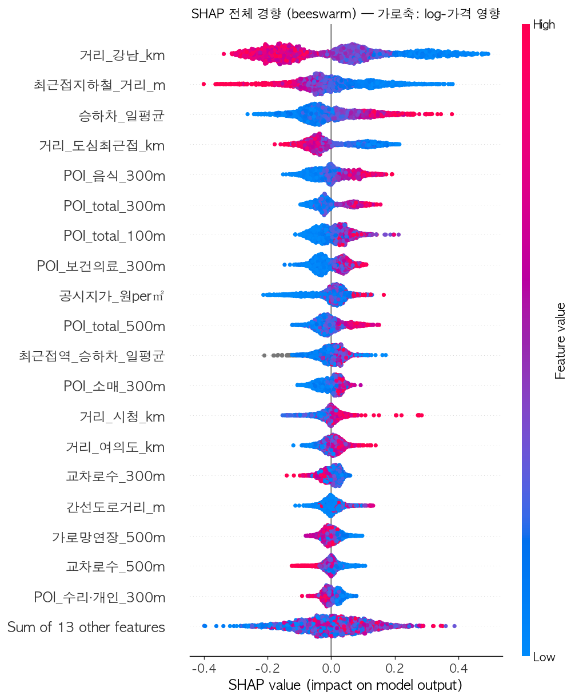

# 서울 버스정류장 광고가 예측 · seoul-bus-ad-pricing

> 좌표를 입력하면 그 위치 버스정류장의 **월 광고 단가(원/면)** 를 예측하고, **SHAP으로 "왜 그 가격인가"** 를 설명하는 회귀 모델·도구.

도시공학 「데이터기반도시설계」 팀 프로젝트. 단순 가격 예측이 아니라 **도시의 물리적 구조(중심지 접근성·교통·상권·도로망)가 입지의 상업적 가치를 어떻게 결정하는가**를 데이터로 보이는 것이 핵심입니다.

`Python 3.12` · `XGBoost` · `SHAP` · `scikit-learn` · `osmnx` · `uv`



> 250m 격자 7,883칸의 예측 광고가. **강남역 일대가 최대 핫스팟**, 시청·여의도가 2차 중심 — 도심 접근성이 입지의 상업적 가치를 지배함을 한 장으로 보여준다.

---

## 한눈에

```text
$ uv run python model/predict.py 37.4979 127.0276      # 강남역

좌표 (37.4979, 127.0276)
  예측 광고가: 1,135,600원/면
  80% 구간:   673,898 ~ 1,838,911원
  자치구(근사): 서초구 · 최근접 학습정류장 95m
  주요 요인(SHAP, %는 가격 배수효과):
    거리_강남_km        +22.7%      ← 강남에 가까워 +22.7%
    최근접지하철_거리_m   +15.3%
    거리_도심최근접_km    +9.8%
    POI_total_300m    +9.4%
    POI_음식_300m      +6.8%
```

서울 **2,553개** 버스정류장의 실제 광고가(덕플레이스)를 정답으로, **좌표에서 산출 가능한 도시구조 31피처**만으로 학습했습니다. 신규 위치에서 구할 수 없는 정보(과거 광고이력 등)는 쓰지 않아 임의 좌표에도 적용됩니다.

## 결과 요약

| 검증 방식 | MAE | RMSE | MAPE | R² |
|---|--:|--:|--:|--:|
| 무작위 KFold *(지역 내 보간)* | 191,799원 | 283,804원 | 33.1% | **0.58** |
| 자치구 GroupKFold *(새 지역 일반화)* | 234,067원 | 331,854원 | 39.9% | **0.32** |

baseline 사다리: Dummy `R²-0.05` → Linear `0.42` → RandomForest `0.56` → **XGBoost `0.58`**

**핵심 발견**
- **중심지 접근성(특히 강남까지 거리)이 가격을 지배** — 단독으로 R² 0.45.
- 무작위 0.58 ↔ 자치구 0.32 격차 = **데이터 적은 외곽의 신뢰도 한계**를 정량화(격자에 `신뢰도` 열로 노출).
- **버스 승하차는 단독 R²≈0** — 수요량만으로는 가격을 설명 못 함("유동인구로 가격 역산" 우려 완화).
- **도로망 형태는 거의 무기여** — 중심성·상권 외 추가 설명력 ≈0(ablation으로 검증).

## 왜 비싼가 — SHAP 전체 경향



가로축 = log-가격에 미친 영향. 파랑=낮은 값/빨강=높은 값. 강남·도심·지하철에 **가까울수록**, 상권·승하차가 **많을수록** 가격이 오릅니다. 도로망 피처(아래쪽)는 분산이 거의 없습니다.

## 사용법

```bash
# 좌표 1개 예측 (첫 실행 ~15초 로딩)
uv run python model/predict.py <위도> <경도>

# 여러 좌표 연속 테스트 (1회 로드 후 반복 입력)
uv run python model/try_predict.py
```

라이브러리로:
```python
from predict import PricePredictor          # model/ 경로에서
p = PricePredictor()
p.predict(37.4979, 127.0276)                # → 예측가·오차범위·top_factors·신뢰도
```

빠른 조회만 필요하면 **`model/grid_250m.csv`** (서울 7,883칸 사전계산: 예측가·오차범위·위치별 SHAP top5)를 직접 읽으면 됩니다. 자세한 인계 문서는 [`model/README.md`](model/README.md).

## 데이터

정답(Y)은 덕플레이스 광고가, 입력(X)은 전부 좌표 기반 공공데이터입니다. 출처·수집법·라이선스 상세는 [`data/seoul/raw/README.md`](data/seoul/raw/README.md).

| 분류 | 피처 | 출처 |
|---|---|---|
| Y 광고가 | 월 광고 단가(원/면) | 덕플레이스 |
| 교통 | 버스 승하차·경유노선수 / 지하철 접근성 | 서울 열린데이터광장 |
| 토지 | 개별공시지가 | 국토부 V-World |
| 상권 | POI 밀도(100/300/500m·업종 10종) | 소상공인 상가(53.7만) |
| 지역 | 3도심(시청·강남·여의도) 거리 | 좌표 계산 |
| 도로망 | 교차로·가로망·간선도로(300/500m) | OpenStreetMap |

> 대용량 raw 데이터(상가·승하차·도로망, 약 660MB)는 **Git LFS**로 관리됩니다. 클론 후 `git lfs pull`로 받으세요.

## 프로젝트 구조

```text
seoul-bus-ad-pricing/
├─ model/                    # ⭐ 산출물(인계)
│  ├─ predict.py                 # 좌표 → 예측가+오차+SHAP
│  ├─ try_predict.py             # 대화형 테스터
│  ├─ feature_extractor.py       # 좌표 → 32피처 재계산
│  ├─ grid_250m.csv              # 서울 7,883칸 사전계산
│  ├─ xgb_model.joblib           # 학습된 모델
│  ├─ shap_global_*.png/csv      # SHAP 전체 경향
│  └─ README.md                  # 사용법·성능·한계·웹팀 의존
├─ scripts/                  # 수집·조립·모델링·평가 스크립트
├─ data/seoul/               # 가격(Y)·피처(X)·모델테이블·raw(LFS)
├─ CLAUDE.md                 # 작업 지침·현재 상태
├─ claude_code_첫메시지.md   # 기획 원문(SSOT) + 최종 사용 데이터
└─ 수집_사양서.md            # Y(덕플레이스) 수집 방법론
```

## 재현

```bash
uv sync                                   # 의존성 (Python 3.12)
git lfs pull                              # raw 데이터(LFS)
uv run python scripts/train_eval.py       # baseline 사다리 + 두 CV
uv run python scripts/tune_xgb.py         # XGBoost 튜닝
uv run python scripts/ablation.py         # 피처군 기여
uv run python scripts/shap_analyze.py     # 모델 적합·저장 + SHAP
uv run python scripts/build_grid.py       # 격자 테이블
```
API 키가 필요한 단계(공시지가·지하철)는 `.env`에 키를 넣어야 합니다(`KAKAO_DEVELOPER_PLATFORM_KEY`·`V_WORLD_DEVELOPER_KEY`·`SEOUL_OPENAPI_KEY`).

## 한계

- 수집가는 실거래가가 아닌 **호가**일 수 있고, 제작·설치비 포함 / 대행사 **단가표 계단값**(연속 아님).
- 데이터 적은 **외곽 지역 예측은 신뢰도 낮음**(자치구 CV R² 0.32 — 격자 `신뢰도` 열 참고).
- 임의 좌표의 버스 승하차·공시지가는 **최근접 학습정류장 값으로 대체**(실측 아님).

---

*웹/REST 서빙은 별도 작업으로 진행됩니다(공유 계약 = `model/grid_250m.csv` + `model/predict.py`).*
