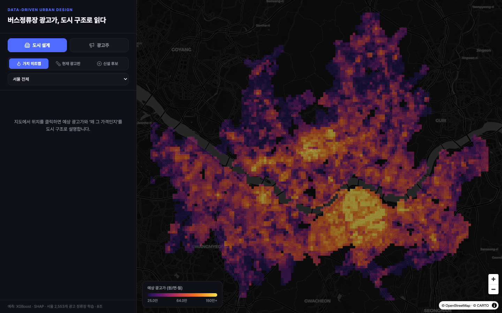
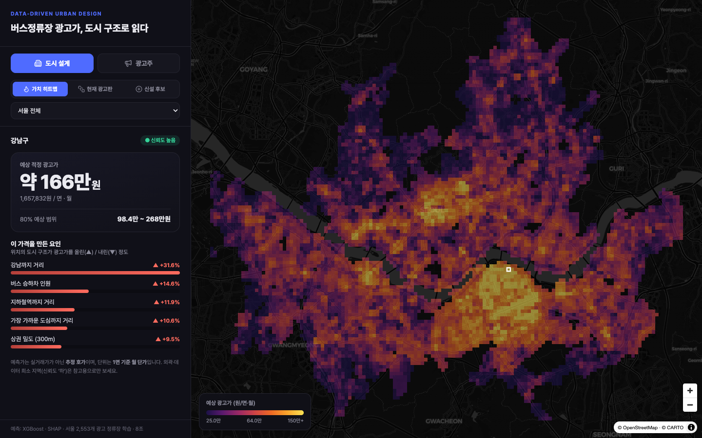
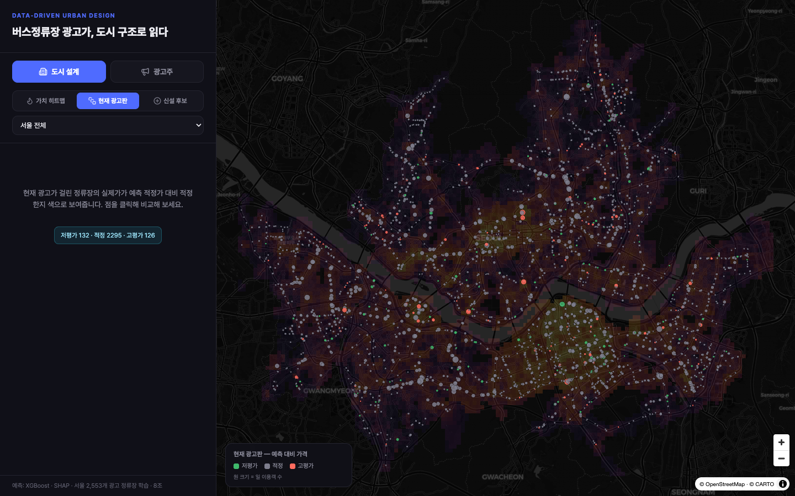
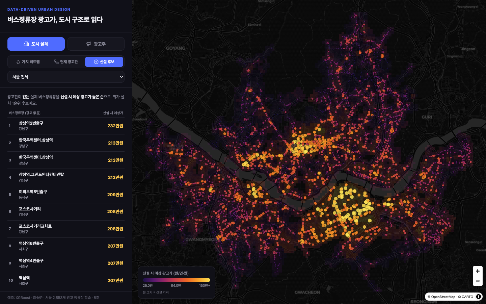
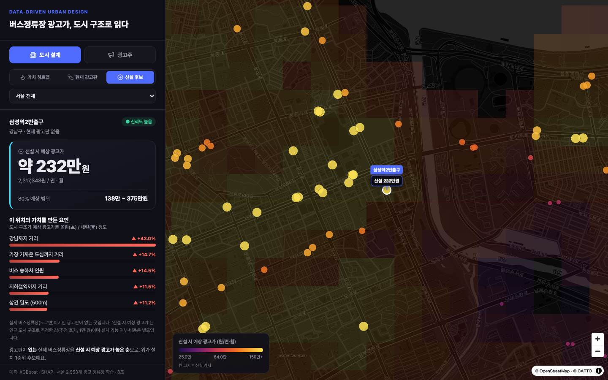
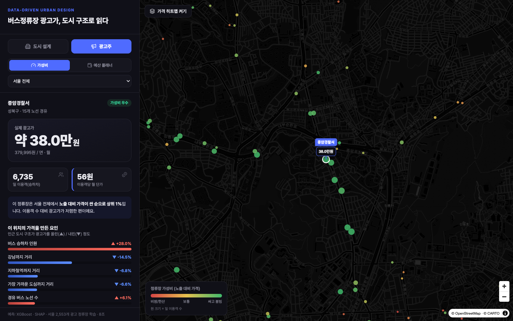
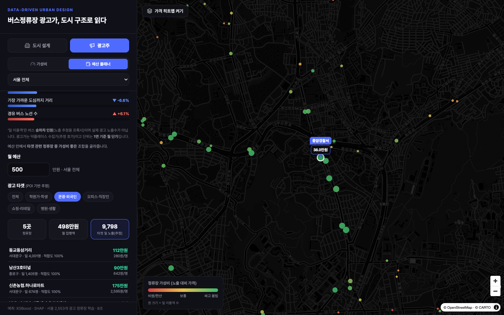

# 버스정류장 광고가 — 웹 도구 (`web/`)

> 좌표 기반 예측 모델(`../model`)을 **실제 사용자가 의사결정에 쓰는 지도 도구**로 구현한 정적 웹.
> 같은 데이터를 **두 페르소나**가 다르게 본다 — **도시 설계자**(가치·신설 후보)와 **광고주**(가성비·예산).



`React + Vite + TypeScript + MapLibre GL` · 정적 빌드 · API 키 0 (CARTO 다크 베이스맵)

---

## 1. 무엇을 하는 도구인가

상호의 모델은 *"좌표 → 그 위치 버스정류장의 예측 광고가(원/면·월) + 왜 그 가격인지(SHAP)"* 를 내놓는다.
이 웹은 그 출력을 **누가 무슨 결정을 하려고 쓰는가**로 뒤집어, 지도 위에서 답을 준다.

- **서울 7,883칸(250m 격자)** 의 예측 광고가 = 가치 표면(히트맵)
- **광고 정류장 2,553개**(덕플레이스 실제 광고가) = 현재 인벤토리
- **광고판 없는 도로변 버스정류장 4,663개**(마스터 11,250 − 광고 2,553) = 신설 후보

## 2. 왜 이렇게 만들었나 (설계 의도)

모델 분석의 핵심 발견이 이 도구의 골격을 결정했다.

> **가격은 중심지 접근성(강남·여의도·시청)이 만든다. 유동인구(승하차)는 가격을 거의 설명하지 못한다(단독 R²≈0).**

여기서 두 가지가 따라 나온다.

1. **가격과 노출이 분리된다** → "사람은 많이 지나가는데 가격은 싼 자리"(가성비)와, "가치는 높은데 광고판이 없는 자리"(신설 후보)가 **실제로 존재한다.** 이게 광고주·도시설계자 각각의 노른자다.
2. **단순 가격 계산기로는 의미가 없다.** 숫자만 보여주면 결정을 못 한다 → 비교·랭킹·적정성 판정·예산 플래닝처럼 **결정을 끝까지 받쳐주는** 기능으로 설계했다.

**정직성 원칙**: 이 모델은 *가격*을 예측하지 *성과(실제 노출수·전환)* 를 예측하지 않는다. 그래서 노출은 **승하차(프록시)**, 광고 타겟은 **주변 업종(POI) 구성(추정)** 으로 명시하고, 예측가는 *추정 호가*임을 UI에 계속 표기한다.

---

## 3. 화면 구성

상단에서 **도시 설계 / 광고주** 페르소나를 고르고, 그 아래 서브모드로 세부 기능을 전환한다.

### 🏙 도시 설계자용

#### ① 가치 히트맵 — 가치를 한눈에 + 클릭해서 이유까지
서울 전역의 예측 광고가를 250m 격자 색으로. 강남·여의도·시청이 핫스팟으로 떠, *도시 구조가 입지 가치를 만든다*는 메시지가 한 장에 보인다. **클릭하면** 그 위치의 예상 적정가·80% 범위·신뢰도와 **"왜 이 가격인지"(SHAP 요인)** 를 도시 구조로 설명한다.


> 강남 한 칸 클릭 → 약 166만원, 주요 상승 요인: 강남까지 거리 +31.6% · 버스 승하차 +14.6% …

#### ② 현재 광고판 — 가치 대비 적정성 비교
광고가 걸린 2,553개 정류장을, **실제가가 예측 적정 범위 대비 싼지/적정한지/비싼지** 색으로 칠한다(저평가 132 · 적정 2,295 · 고평가 126). 점을 클릭하면 실제가 vs 예측가 + 차이%를 보여준다.


> 초록=저평가, 회색=적정, 빨강=고평가. 지자체·매체사가 가격 합리성을 점검하는 화면.

#### ③ 신설 후보 — 광고판 없는 정류장 + 신설 시 가치 + 랭킹
**버스정류장은 있는데 광고판이 없는** 도로변 정류장만 골라, 각각 **"신설 시 예상 광고가"**(인근 격자 예측)를 붙이고 **높은 순으로 랭킹**한다. 가치가 높은데 비어 있는 곳 = 광고판 설치 1순위.



> TOP = 삼성역·코엑스(한국무역센터)·여의도역·역삼역. 노른자인데 광고판이 없는 자리. 클릭 → 신설 시 예상가 232만원 + 가치 요인.

### 📣 광고주용

#### ④ 가성비 — 노출 대비 싼 자리 찾기
정류장을 **노출(승하차) 대비 가격(이용객당 단가)** 으로 색칠하고 *싼 순으로* 랭킹. "목 좋은데 싼" 저평가 매물을 찾는다. 클릭 → 실제가·일 이용객·이용객당 단가·가성비 등급.


> 종암경찰서 38만원·일 6,735명·56원/명 = 가성비 최상위. (가격이 중심성으로 결정되니, 외곽 목 좋은 자리가 노출당 훨씬 싸다 — 모델 발견의 직접 응용.)

#### ⑤ 예산 플래너 — 예산 + 타겟으로 정류장 조합 추천
예산을 넣으면 **노출을 가장 많이 모으는** 정류장 바구니를 그리디로 짜준다. **광고 타겟**(학원가·학생 / 관광·외국인 / 오피스·직장인 / 쇼핑·리테일 / 병원·생활)을 고르면, 그 타겟 밀집 정류장 위주로 다시 짠다.


> 관광·외국인 타겟 → 홍대(동교동)·남산·신촌 등 숙박 밀집지가 적합도 100%로 선정. 월 500만원으로 5곳·타겟 노출 9,798명.

---

## 4. 유즈케이스 (상황별)

| 누가 | 상황 | 어느 화면 |
|---|---|---|
| **지자체·도시설계자** | 신규 버스쉘터 광고료를 얼마로 책정? | 가치 히트맵 클릭 → 예측 적정가 |
| | 광고판을 어디에 새로 설치? | 신설 후보 랭킹 (삼성역·여의도…) |
| | 대행사 단가가 합리적인가 심의 | 현재 광고판 (적정성 색) |
| **광고주·소상공인** | 이 자리 광고가가 적정한가 | 현재 광고판 / 가성비 카드 |
| | 가성비 좋은 자리 찾기 | 가성비 랭킹 |
| **광고 대행사·매체사** | 예산 안에서 타겟 도달 최대화 | 예산 플래너 + 타겟 |

---

## 5. 데이터 & 방법 (정직성)

| 항목 | 값 | 비고 |
|---|---|---|
| 예측 광고가 | XGBoost(log1p) · SHAP | 좌표 산출 도시구조 31피처. 실거래 아닌 **추정 호가** |
| 노출 | 버스 승하차 일평균 | 실제 광고 노출수 아님(**프록시**) |
| 가성비 | 가격 ÷ 일 이용객 (원/명) | 낮을수록 가성비 ↑ |
| 광고 타겟 | 300m POI 업종 구성 | 인구통계 실측 아님(**추정**). 데이터로 변별되는 5종만 채택 |
| 신설 후보 | 마스터 11,250 − 광고 2,553, 도로변만 | 신설 시 가치 = 인근 격자 예측가 |
| 적정성 | 실제가 vs 예측 80% 범위 | 저평가/적정/고평가 |

- **"젊은층/트렌디(성수·홍대)" 타겟은 의도적으로 뺐다** — 소상공인 업종분류에 그 신호가 없어 데이터로 정직하게 잡히지 않는다.
- 외곽·데이터 희소 지역(신뢰도 '하')은 참고용. 단위는 전부 **원/면·월**.

---

## 6. 기술 / 실행

```bash
npm install
npm run dev        # localhost:5173 (빌드 전 build:data 자동 실행)
npm run build      # 정적 빌드 → dist/ (Cloudflare Pages 등에 그대로 배포)
```

- **데이터 파이프라인** `scripts/build-data.mjs` 가 빌드 때 자동 실행:
  `model/grid_250m.csv → grid.json`, `data/seoul/모델테이블.csv → stops.json`(+적정성),
  `서울시버스정류소위치정보.xlsx → candidates.json`(신설 후보). 런타임은 이 JSON만 읽어 **백엔드 0**.
- 지도 마커 반경은 **줌에 따라 스케일**(줌아웃 시 작아짐), 색은 모드별 의미(가격/가성비/적정성/신설가치).
- **README 스크린샷 재생성**: `npm run dev` 띄운 뒤 `node scripts/shots.mjs` (Playwright로 1440×900 캡처 → `docs/img/`).
- `model/`·`data/`·`scripts/(파이썬)` 은 **읽기 전용**(다른 팀원 영역). 웹은 읽어서 자산만 생성.

---

## 7. 배포 (Cloudflare Workers · `bus.sings.dev`)

순수 정적 빌드라 백엔드 없이 Cloudflare Workers 정적 에셋으로 올린다. 설정은 `wrangler.jsonc` (Worker 이름 `bus-sings-dev`, 에셋 `./dist`, 커스텀 도메인 `bus.sings.dev`).

### 자동 배포 (Cloudflare Workers Builds)

**`main`에 push되면 Cloudflare가 자동으로 빌드·배포**한다. GitHub repo가 Worker에 연결돼 있고(대시보드 → Worker → Settings → Builds), Cloudflare 내부 CI라 **API 토큰·시크릿이 불필요**하다. 블로그(sings.dev)와 달리 빌드에 헤드리스 크롬·시스템 폰트 같은 특수 환경이 필요 없어, GitHub Actions 없이 이것만으로 충분하다.

| Builds 설정 | 값 |
|---|---|
| Root directory | `web` |
| Build command | `npm run build` |
| Deploy command | `npx wrangler deploy` |
| Production branch | `main` |

### 수동 배포 (로컬 · 폴백)

```bash
npx wrangler login   # 최초 1회만 (브라우저 OAuth)
npm run deploy       # = npm run build && wrangler deploy
```

- `wrangler.jsonc`의 `routes`에 `custom_domain: true`로 잡혀 있어 **첫 배포 때 `bus.sings.dev`의 DNS·SSL이 자동 생성**된다(sings.dev 존이 같은 Cloudflare 계정에 있을 때).

---

<details>
<summary>원래 인계 브리프 (handoff brief)</summary>

이 폴더는 웹 프론트엔드 담당 작업 공간입니다. 초기 인계 계약은 **모드 A — 격자 조회**(`../model/grid_250m.csv` 의 사전계산값을 클릭 좌표 최근접 칸으로 조회, 백엔드 불필요)였고, 현재 구현은 여기에 **실제 광고 정류장(`모델테이블.csv`)·마스터 정류장(xlsx)** 을 더해 위 5개 화면으로 확장했습니다. 임의 좌표 실시간 예측이 필요해지면 `../model/predict.py` 를 감싸는 모드 B를 논의하면 됩니다(현재는 범위 밖). 전체 맥락: `../README.md` · `../CLAUDE.md`, 모델 상세: `../model/README.md`.

</details>
